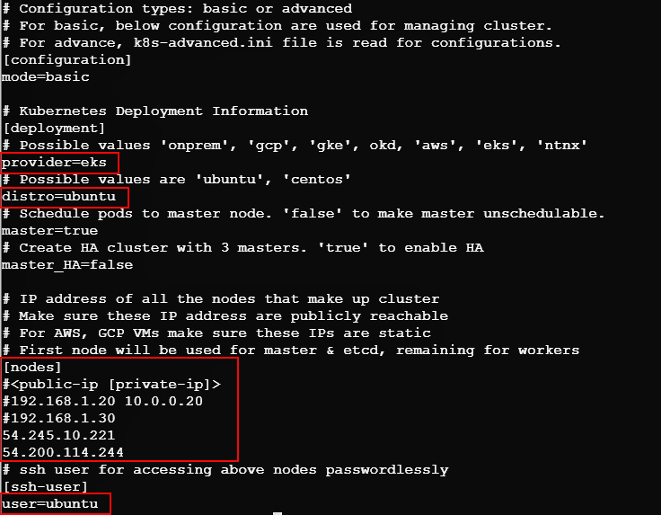

# backbase1
# kube-eks
Run the preinstall scripts, the config file can be copied by including:

The region where the EKS cluster is running (e.g. us-west-2)

The EKS cluster name

The following commands will accomplish these steps:

  bash preinstall.sh
  source ~/.bashrc
  aws eks --region <EKS Region>  update-kubeconfig --name <EKS Cluster Name>
  kubectl get nodes -o wide

The output from the “kubectl get nodes” command will provide the list of IP addresses and node names.

Note

The IP addresses were obtained in the previous step with the “kubectl get nodes” command

